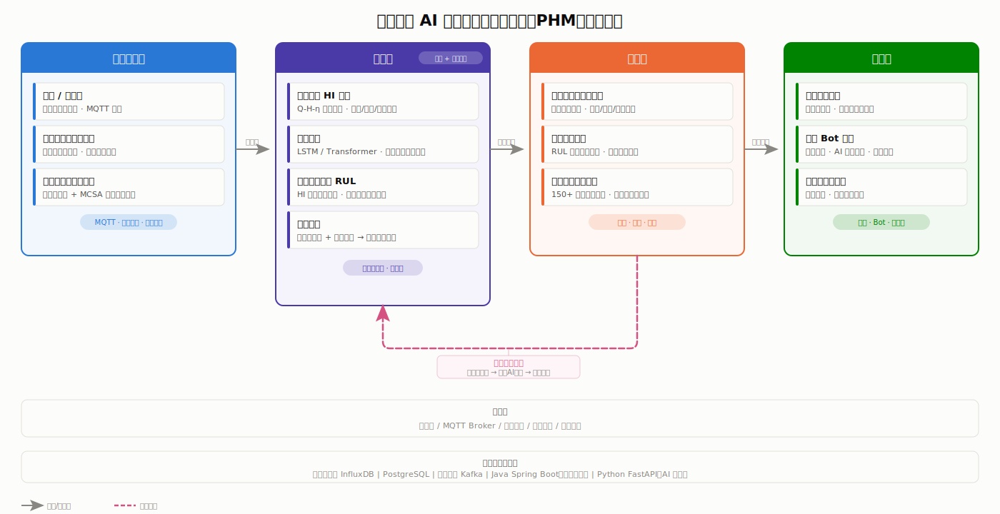

# PumpGuard 项目架构说明书

> 版本：v1.0 | 日期：2026-07-18 | 分支：dev-architecture
>
> 本文档与 [项目方案规划.md](./项目方案规划.md)、[开题报告.md](./开题报告.md)、[架构图.html](./架构图.html) 严格一致，如有冲突以本文档为准。

---

## 一、系统概述

### 1.1 项目定义

PumpGuard 是一套**物理机理与数据双驱动**的水泵智慧预测与健康管理（PHM）系统，面向利欧集团全球百万台泵群，实现从设备接入、健康评估、故障预警到运维调度的全自动闭环。

### 1.2 核心设计理念

| 理念 | 说明 |
|------|------|
| **存量兼容、增量智能** | 新泵老泵都能接入，不绑架硬件改造 |
| **机理兜底、数据进化** | Q-H-η 物理曲线作为先验，零故障样本不乱报警；维修反馈驱动模型持续进化 |
| **Java 为骨、Python 为脑** | Java Spring Boot 做业务主脑，Python FastAPI 做 AI 引擎，微服务协作 |
| **协作原生** | 深度集成飞书 AI 工具（多维表格智能体 / Bot / 审批流），运维不游离于协作之外 |

### 1.3 国标对齐

系统四层架构对齐 **GB/T 46315-2025《工业互联网平台 设备健康管理规范》**：

| 国标层次 | 本系统对应 |
|---------|-----------|
| 工业设备层 | 数据接入层 |
| 工业边缘层 | 边缘网关 |
| 工业 PaaS 层 | 算法层 |
| 工业应用层 | 决策层 + 展示层 |

---

## 二、系统架构总览

### 2.1 架构图



> 交互版本（含深色模式）：[架构图.html](./架构图.html)

### 2.2 四层一闭环

```
┌──────────────────────────────────────────────────────────────────┐
│                        展示与协同层                               │
│  数字孪生看板  │  飞书 Bot 告警 + AI 智能问答  │  移动端巡检助手     │
├──────────────────────────────────────────────────────────────────┤
│                        决策层                                     │
│  工单自动生成与路由  │  备件库存优化  │  全球服务网络调度            │
├──────────────────────────────────────────────────────────────────┤
│                        算法层（AI 引擎）                           │
│  健康指数 HI 计算  │  故障预测  │  剩余寿命 RUL 预测  │  根因分析    │
├──────────────────────────────────────────────────────────────────┤
│                        数据接入层                                 │
│  新泵/智能泵 MQTT 直采  │  老旧泵(有变频器) 边缘网关  │  老旧泵(无变频器) MCSA │
├──────────────────────────────────────────────────────────────────┤
│  边缘层：传感器 / MQTT Broker / 边缘网关 / 协议转换 / 特征提取       │
│  基础设施：InfluxDB / PostgreSQL / Kafka / Java Spring Boot / Python FastAPI │
└──────────────────────────────────────────────────────────────────┘

反馈闭环：决策层 ──→ 维修工程师确认 ──→ 标记AI诊断正误 ──→ 算法层模型更新
```

### 2.3 数据流

| 流向 | 起 → 讫 | 内容 | 触发方式 |
|------|--------|------|---------|
| **数据流** | 数据接入层 → 算法层 | 清洗后的传感器数据（振动/温度/电流/压力/流量） | 持续流式 |
| **预警事件** | 算法层 → 决策层 | 异常检测结果 / HI 评分 / RUL 预估 / 根因报告 | 事件触发 |
| **运维指令** | 决策层 → 展示层 | 工单 / 告警 / 调度指令 / 备件需求 | 事件触发 |
| **反馈闭环** | 决策层 → 算法层 | 维修确认结果 / AI 诊断正误标记 | 人工触发 |
| **告警推送** | 展示层 → 飞书 | Bot 消息卡片 / 多维表格更新 / 审批流转 | 事件触发 |

---

## 三、各层详细设计

### 3.1 数据接入层

#### 3.1.1 三层分级接入策略

| 设备类型 | 接入方式 | 采集数据 | 上云路径 | 硬件要求 |
|---------|---------|---------|---------|---------|
| **新泵 / 智能泵** | 原生传感器直采 | 高频振动、温度、电流波形、压力、流量 | MQTT → IoT 平台 | 设备自带传感器 |
| **老旧泵（有变频器）** | 接入变频器已有数据 | 电流、频率、运行状态 | 边缘网关 → MQTT | 变频器已安装 |
| **老旧泵（无变频器）** | 外挂振动温度复合传感器 + 钳形电流表 | 振动、温度、电流特征（MCSA） | 边缘网关 → MQTT | 外挂传感器（低成本改造） |

#### 3.1.2 MCSA 非侵入式电流特征分析

- **原理**：通过钳形电流表非侵入式采集电机定子电流信号，做 FFT/STFT 频谱分析
- **可检测故障**：不对中、轴承缺陷、叶轮异常、气蚀
- **学术验证**：PumpSpectra 平台在阿尔及利亚海水淡化厂实地验证，准确率 **91.2%**，误报率 **3.8%**（Adaika et al., *Sensors*, 2025）
- **MCSA + AutoML**：达 89% 准确率（Khalikov et al., *J. Mining Institute*, 2025）
- **本系统定位**：作为老旧泵无传感器场景的核心接入手段，是方案落地的前提

#### 3.1.3 边缘网关

- **功能**：协议转换（Modbus / OPC-UA → MQTT）、数据清洗（去噪/插值/异常值过滤）、特征提取（FFT/统计特征/趋势特征）
- **部署**：就近部署于泵站/泵房，可运行于工控机或 ARM 边缘设备
- **协议**：MQTT 上云，QoS 1（至少一次送达）

#### 3.1.4 统一数据模型

边缘网关清洗后上云的数���，统一映射为以下结构：

| 字段 | 类型 | 说明 |
|------|------|------|
| `device_id` | string | 设备唯一标识 |
| `timestamp` | timestamp | 数据采集时间戳 |
| `vibration_x/y/z` | float[] | 三轴振动频谱或 RMS 值 |
| `temperature` | float | 轴承/绕组温度 |
| `current_rms` | float | 电流有效值 |
| `current_thd` | float | 电流谐波畸变率 |
| `pressure_in/out` | float | 进出口压力 |
| `flow_rate` | float | 流量 |
| `rotation_speed` | float | 转速 |
| `device_type` | enum | `smart` / `vfd` / `legacy` |

---

### 3.2 算法层

算法层是本系统的核心竞争力，部署为 **Python FastAPI 微服务**，通过 gRPC 被 Java 业务层调用。

#### 3.2.1 健康指数 HI 计算（核心引擎）

**定义**：

```
HI = f(ΔV_振动, Δη_效率, ΔT_温升, t_运行时长)

其中：
  ΔV_振动 = 实际振动 RMS 偏离理论振动 RMS 的程度
  Δη_效率 = 实际效率（流量×扬程/功率）偏离额定效率的程度
  ΔT_温升 = 轴承/绕组温度趋势变化率
  t_运行时长 = 累计运行时间（用于退化基线对比）
```

**物理基线**：水泵 Q-H-η 特性曲线（流量-扬程-效率曲线）作为理论参考值。物理模型回答"这个工况下设备应该是什么样"，数据模型学习"实际偏差意味着什么"。

**HI 输出**：0-100 分制，100 = 完全健康，0 = 需立即停机。分级：

| HI 值 | 等级 | 含义 | 建议动作 |
|-------|------|------|---------|
| 85-100 | 健康 | 正常运行裕度充足 | 持续监测 |
| 70-85 | 关注 | 轻度退化，性能开始偏离基线 | 计划性检查 |
| 50-70 | 警告 | 中度退化，需安排维修 | 生成工单 |
| 30-50 | 严重 | 重度退化，故障概率高 | 紧急工单 + 备件预警 |
| 0-30 | 危险 | 随时可能失效 | 立即停机维修 |

**关键设计理由**：纯数据驱动的异常检测在零故障样本下不可靠（乱报警），物理基线解决了冷启动问题。此设计对应开题报告中的"机理兜底"理念。

#### 3.2.2 故障预测引擎

| 方法 | 适用场景 | 输入 | 输出 |
|------|---------|------|------|
| **机理规则** | 零故障/罕见故障模式 | 物理参数偏离度 | 故障概率 + 可解释原因 |
| **LSTM** | 时序依赖型故障（如轴承退化） | 振动频谱序列 | 未来 N 天故障概率 |
| **Transformer** | 多变量长时间序列 | 全部传感器时序 | 故障类型分类 + 概率 |
| **联合判定** | 所有场景 | 机理规则 + DL 输出 | 融合判定的最终预警 |

**预测时间窗口**：目标提前 **7-21 天** 预警（参考石油化工行业旋转设备预警时间从 7 天到 21 天的提升趋势）。

#### 3.2.3 剩余寿命 RUL 预测引擎

- **方法**：HI 退化趋势外推 + 同型号设备历史退化曲线相似性匹配
- **小样本策略**：迁移学习（从同型号 → 新型号）+ GAN/VAE 数据增强（仿真引擎生成故障样本）
- **学术支撑**：Kumar et al. (2024, *Energies*) 综述将 PINN 和迁移学习列为 RUL 预测前沿方法；刘俊孚等 (2024) 五类小样本方法综述
- **输出**：预估剩余运行天数 + 置信区间

#### 3.2.4 根因分析引擎

- **方法**：故障特征库（特征→故障映射表）+ 因果推理图
- **输入**：振动频谱特征 + HI 各子指标 + 工况参数
- **输出**：可能故障原因（排序）+ 置信度 + 建议处置方案
- **示例输出**："轴承内圈磨损（置信度 89%），建议更换轴承，参考备件编号 SKF-6305，预计工时 4 小时"

#### 3.2.5 模型管理

- **初始训练**：基于仿真数据引擎生成的退化数据 + 公开数据集（NASA IMS / Kaggle Digital Twin）
- **在线更新**：维修反馈回流 → 增量学习（非全量重训，避免灾难性遗忘）
- **版本管理**：MLflow 进行模型版本追踪，支持回滚
- **A/B 测试**：新模型先在影子模式运行，确认无误报率下降后再上线

---

### 3.3 决策层

#### 3.3.1 工单自动生成与路由

```
预警触发 → 紧急程度评估（基于 HI 值 + 故障类型）
        → 工单生成（含故障描述/建议处置/备件清单）
        → 工程师匹配（距离权重 0.4 + 技能匹配 0.4 + 当前负载 0.2）
        → 飞书审批流转
```

#### 3.3.2 备件库存优化

- **触发**：RUL < 30 天 → 自动生成备件需求预测
- **计算**：失效概率 × 缺货成本 → 库存建议量
- **优化**：全球仓库分布 → 建议调配路径

#### 3.3.3 全球服务网络调度

- 150+ 国家服务区域分组 → 就近派单
- 跨国场景：优先区域备件 + 远程专家支持
- 路径优化：多站点巡检路线规划（TSP 变体）

---

### 3.4 展示与协同层

#### 3.4.1 数字孪生看板（Web）

- **全球一张图**：GeoJSON 地图标注全球泵群位置，颜色 = HI 健康等级
- **下钻能力**：洲际 → 国家 → 泵站 → 单台泵
- **单泵页面**：实时传感器数据、历史维修记录、同型号退化基线对比、全生命周期健康档案
- **技术栈**：Vue 3 + ECharts + Mapbox/Leaflet

#### 3.4.2 飞书 Bot 告警

- **推送时机**：HI 跌破阈值 / 故障预测触发 / RUL 低于警戒线
- **推送内容**：告警卡片（设备名称/位置/故障预测/建议处置/一键生成工单）
- **智能问答**：自然语言查询（如"3 号线 2 号泵现在健康度多少？"）
- **集成方式**：飞书开放平台 Bot API

#### 3.4.3 飞书多维表格智能体

- 运维台账自动记录（每次维修自动写入一行）
- 工单状态实时追踪（待处理/处理中/已完成）
- SLA 风险自动预警（超时未响应 → @负责人）
- 限免期可用，基于豆包 2.0 大模型

#### 3.4.4 移动端巡检助手

- **平台**：飞书小程序 或 PWA
- **功能**：扫码查设备档案、语音录入巡检记录、拍照上传故障现场、维修反馈标记（AI 诊断正确/错误）

---

### 3.5 反馈闭环

```
维修工程师到达现场
     │
     ▼
确认真实故障原因 ──→ 移动端标记 AI 根因是否正确
     │                        │
     ▼                        ▼
完成维修                  反馈数据回写 Kafka
                              │
                              ▼
                         算法层增量学习
                              │
                              ▼
                         模型更新（MLflow 版本记录）
```

**闭环价值**：
- 每修一次泵，模型聪明一分
- 将老师傅的隐性经验沉淀为可传承的算法模型
- 从根本上解决工业 AI 标注数据匮乏的瓶颈

---

## 四、技术架构

### 4.1 技术栈

| 层次 | 技术 | 角色 |
|------|------|------|
| **业务层** | Java 17 + Spring Boot 3.x | 设备管理、数据接入路由、工单流转、权限管理、告警路由、飞书 API 集成 |
| **AI 层** | Python 3.11 + FastAPI | 异常检测、RUL 预测、根因分析、HI 计算、模型训练 |
| **通信** | gRPC（主）/ REST（辅） | Java ↔ Python 微服务通信 |
| **时序库** | InfluxDB 2.x | 传感器时序数据存储 |
| **业务库** | PostgreSQL 15 | 设备台账、工单、用户、权限、维修记录 |
| **消息队列** | Apache Kafka | 数据流缓冲、事件驱动解耦 |
| **前端** | Vue 3 + ECharts + Leaflet | 数字孪生看板 |
| **边缘** | Rust / Go（轻量网关） | 协议转换、数据预处理、特征提取 |
| **模型管理** | MLflow | 模型版本、实验追踪、A/B 测试 |
| **容器化** | Docker + Docker Compose | 本地开发与演示部署 |
| **仿真引擎** | Python + NumPy/SciPy | 泵群退化仿真数据生成 |

### 4.2 微服务划分

```
┌──────────────────────────────────────────────────────┐
│                   API Gateway (Spring Cloud Gateway)  │
└────┬─────────┬──────────┬──────────┬─────────────────┘
     │         │          │          │
     ▼         ▼          ▼          ▼
┌─────────┐ ┌─────────┐ ┌─────────┐ ┌──────────────┐
│设备管理  │ │工单服务  │ │告警服务  │ │飞书集成服务    │
│Service  │ │Service  │ │Service  │ │Service       │
└─────────┘ └─────────┘ └─────────┘ └──────────────┘
     │         │          │          │
     └─────────┴──────────┴──────────┘
                    │ gRPC
                    ▼
┌──────────────────────────────────────────────────────┐
│                  AI Engine (Python FastAPI)           │
│  ┌──────────┐ ┌──────────┐ ┌──────────┐ ┌─────────┐ │
│  │HI 计算    │ │故障预测   │ │RUL 预测   │ │根因分析  │ │
│  │Service   │ │Service   │ │Service   │ │Service  │ │
│  └──────────┘ └──────────┘ └──────────┘ └─────────┘ │
└──────────────────────────────────────────────────────┘
```

### 4.3 数据存储

| 数据类型 | 存储 | 说明 |
|---------|------|------|
| 传感器时序数据 | InfluxDB | 每秒/每分钟级，保留 90 天热数据 + 1 年冷数据 |
| 设备台账 | PostgreSQL | 设备型号/参数/Q-H-η 曲线/安装日期/位置 |
| 工单数据 | PostgreSQL | 工单创建/指派/处理/关闭全生命周期 |
| 维修记录 | PostgreSQL | 故障原因/处理措施/备件消耗/AI 诊断正误标记 |
| 用户与权限 | PostgreSQL | RBAC 角色权限模型 |
| 告警事件 | Kafka → PostgreSQL | 事件溯源，可回溯 |
| 模型文件 | MinIO / 本地文件系统 | .pkl / .pt / .onnx 格式 |

---

## 五、接口定义（核心）

### 5.1 gRPC 接口（Java → Python AI Engine）

```protobuf
service AIEngine {
  // 健康指数计算
  rpc ComputeHI(HIRequest) returns (HIResponse);

  // 故障预测
  rpc PredictFault(FaultRequest) returns (FaultResponse);

  // 剩余寿命预测
  rpc PredictRUL(RULRequest) returns (RULResponse);

  // 根因分析
  rpc AnalyzeRootCause(RCARequest) returns (RCAResponse);

  // 模型更新（反馈触发）
  rpc UpdateModel(FeedbackRequest) returns (UpdateResponse);
}
```

### 5.2 飞书 API 集成

| 集成点 | API | 说明 |
|--------|-----|------|
| Bot 消息推送 | `POST /open-apis/bot/v2/hook/{key}` | 告警卡片推送 |
| 多维表格 | `POST /open-apis/bitable/v1/apps/{app_token}/tables/{table_id}/records` | 运维台账写入 |
| 审批流 | `POST /open-apis/approval/v4/instances` | 工单审批发起 |
| AI 智能问答 | 飞书 aily 智能伙伴 API | 自然语言查询健康度 |

---

## 六、仿真数据引擎

### 6.1 设计目标

为演示方案和初始模型训练提供可控的泵群退化仿真数据，不依赖利欧真实生产数据即可完成完整闭环。

### 6.2 仿真能力

| 维度 | 能力 |
|------|------|
| **泵型号** | 离心泵/轴流泵/混流泵，可配置 Q-H-η 曲线参数 |
| **退化模式** | 正常退化（振动缓升/效率缓降/温度缓升） |
| **故障注入** | 轴承磨损、叶轮气蚀、不对中、密封泄漏、电机电气故障 |
| **工况模拟** | 定速/变速、不同负载率、启停事件 |
| **传感器模拟** | 振动频谱（含谐波）、温度、电流波形、压力、流量 |
| **规模** | 支持 150+ 台虚拟泵并发仿真 |

### 6.3 参考数据集

- Kaggle Physics-Grounded Digital Twin（150 台泵 run-to-failure，38 万行 × 32 维）
- NASA IMS Bearing Dataset（20 kHz 振动采样，经典 RUL 基准）
- Kaggle Pump Sensor Data（1 台泵 53 传感器 × 22 万分钟，极端类别不平衡）

---

## 七、安全与权限

- **认证**：飞书 OAuth 2.0 登录
- **权限**：RBAC（管理员 / 运维工程师 / 巡检员 / 只读用户）
- **API 安全**：JWT Token + API Key（内部服务间 mTLS）
- **数据脱敏**：设备位置信息按角色分级可见

---

## 八、与已有文档一致性声明

| 已有文档 | 本文档对应章节 | 是否一致 |
|---------|--------------|---------|
| 项目方案规划.md 第二章 | 三、各层详细设计 | ✅ 完全一致 |
| 开题报告.md 第二章 | 二～四 | ✅ 完全一致 |
| 架构图.html | 2.2 四层一闭环 + 2.3 数据流 | ✅ 一一对应 |
| 开题报告.md MCSA 91.2% | 3.1.2 MCSA | ✅ 数据一致 |
| 开题报告.md HI 公式 | 3.2.1 HI 计算 | ✅ 公式一致 |
| 开题报告.md 技术栈 | 4.1 技术栈 | ✅ 技术选型一致 |
